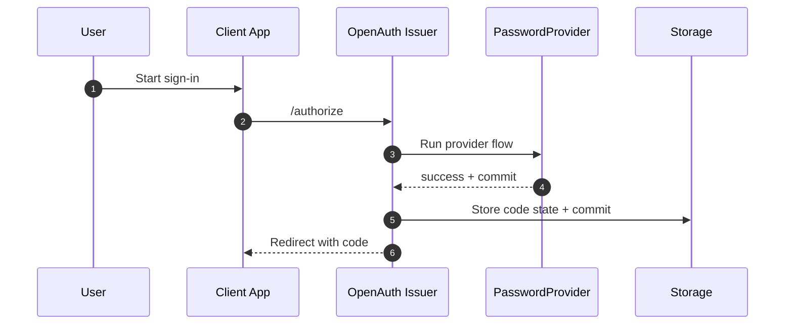
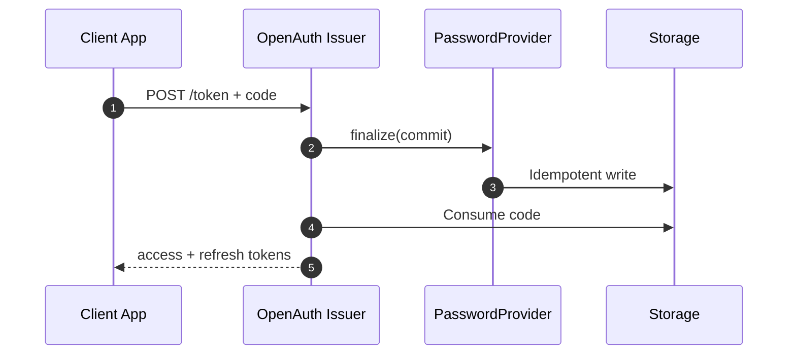

# Lazy registration in OpenAuth

OpenAuth supports two persistence modes for provider-side registration writes:

- `immediate` (default): provider writes happen as soon as the provider flow succeeds.
- `lazy`: provider writes are deferred until the authorization code is exchanged at `/token`.

Use lazy mode when you want to avoid creating partial accounts for users who never finish the OAuth code exchange.

## Why this exists

In code flow, provider success happens before the client exchanges the authorization code. If registration data is persisted too early, you can end up with records for users who abandoned the flow before token exchange.

Lazy registration moves that persistence to the token exchange boundary.

## Flow comparison

| Step | `immediate` | `lazy` |
| --- | --- | --- |
| Provider success callback | Commits registration data now | Stores commit payload in authorization code state |
| Redirect with authorization code | Happens after commit | Happens before commit |
| `/token` code exchange | Issues tokens | First runs provider finalize, then issues tokens |
| User abandons before `/token` | Registration may already exist | No registration is committed |

## Sequence diagrams

Authorize phase:



Token exchange phase:



## Configure lazy mode

```ts
import { issuer } from "@openauthjs/openauth"

const app = issuer({
  // ...
  persistence: {
    registration: "lazy",
  },
})
```

`immediate` remains the default when `persistence.registration` is not set.

## Provider integration contract

When a provider wants lazy persistence, it should:

1. Return `commit` data from `ctx.success(..., { commit })`
2. Implement `finalize(input)` to commit that data later
3. Make `finalize` idempotent (safe on retries)

Example pattern:

```ts
ctx.success(c, { email }, {
  commit: {
    kind: "password-register",
    email,
    password,
  },
})

finalize: async (input) => {
  if (input.data?.kind !== "password-register") return
  const existing = await input.storage.get(["email", input.data.email, "password"])
  if (existing) return
  await input.storage.set(["email", input.data.email, "password"], input.data.password)
}
```

## Storage behavior in code flow

During `/authorize` success in lazy mode, OpenAuth stores the authorization code payload with:

- provider name
- provider properties
- resolved subject
- optional PKCE data
- lazy `commit` payload

At `/token`:

1. OpenAuth validates the code and client binding.
2. If commit payload exists, OpenAuth calls `provider.finalize(...)`.
3. If finalize succeeds, tokens are generated and the code is removed.
4. If finalize fails, OpenAuth returns `server_error` and keeps the code for retry.

## Error and retry semantics

- Missing `finalize` for a lazy commit results in `server_error`.
- Errors inside `finalize` return `server_error`.
- Since code is not consumed on finalize failure, the client can retry `/token`.
- `finalize` must be idempotent because retries may run the same commit more than once.

## PasswordProvider specifics

`PasswordProvider` uses this pattern for registration so user credentials are only persisted after successful token exchange in lazy mode.
